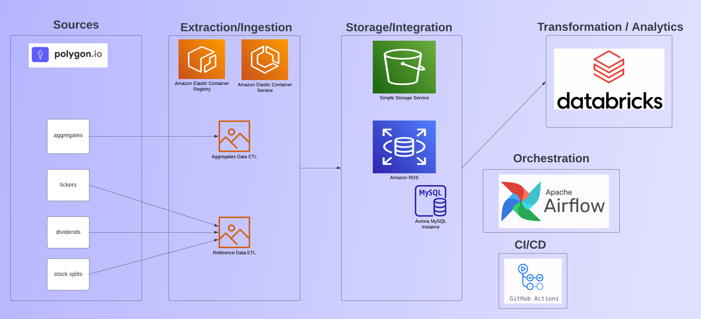

# Polygon Algotrading Environment

## Project Overview
Algorithmic Trading - sometimes shortened to "algotrading" - is the practice of using software-defined triggers to execute trades on securities. A proper algotrading environment necessitates the extraction and storage of technical indicators and other meta information about a security for three reasons:

 1. Back-data is required to train and test a trading model
 2. Live-data is needed to enter and exit positions
 3. "Stale" live-data helps perform forensic analysis of model performance and is used in MLops to tweak existing models (as well as to train new models)

## Dataset Selection and Project Goals
Those familiar with the financial market data space are aware of the technical hurdles and dated solutions offered by large-name brokers. Boutique suppliers target hedge funds and come with steep cost. [Polygon](https://polygon.io/) is a Series-A fintech startup which seeks to democratize access to financial instrumentation. They take a developer-first approach. Polygon has many offerings but one of their most popular - which is also their most expensive at $200/month (at the time of this writing) - offers unlimited historical information and real-time trades.

Algotrading is a hobby of mine. The challenge of collecting data and up-keeping scripts can be costly. Solutions that I haven written in the past are fragile; small changes to compute, storage, or the endpoints necessitate risky code edits. The goal with this project was to develop an architecture that can piecemeal the solution into logical parts and will be robust and resilient by running in the cloud. 

## Solution Architecture

Custom Python extraction and loading scripts for both the aggregates data and reference data from the Polygon REST API. The REST API was chosen due to REST APIs having better support than language-specific wrappers in general. Both scripts are Dockerized and deployed to ECR via GitHub Actions CI/CD.
Airflow DAGs are scheduled daily to spin up EC2 instances via ECS to perform ETL. The reference-data image performs a full refresh of tickers, dividends, and stock splits. This data is under 20MB so it is reasonable to be refreshed daily. The refresh overwrites the previous day's data to an AWS RDS managed MySQL instance. A traditional database was chosen for this data due to the small size and the conceptual intuition of how this type of data is typically used. The aggregates data writes to an S3 bucket and is logically structured based on qualities of the data, such as the ticker, or if the data is raw or adjusted. The Airflow DAG dynamically determines the most recent timestamp of the data recorded in the S3 bucket for the endpoint's targets and passes this information to the ECS task so that data is incrementally updated. Due to intricacies within the API, it is expected that some duplicate data will be ingested, but this is handled within Databricks jobs. 
Databricks is used to perform some transformations and structuring the data in a manner that makes analysis easier.

## Environment Setup / Installation

### ECR/ECS Extraction Containers
Extraction of data from our API source is performed via two Python ELT/ETL scripts housed in docker containers. One container handles the extraction of aggregate candles, and the other container performs ETL for securities reference data (e.g. tickers, splits, dividends, etc.)
#### Elastic Container Registry

First, we must create a repository to host our ETL containers' images in AWS Elastic Container Registry (ECR). 

 1. Login to aws.amazon.com and navigate to Elastic Container Registry
 2. Click "Create repository"
 3. For the repository name, enter "aggregates_etl"
 4. Click Create repository
Repeat the same process as above, but create a repository named "reference_data_etl"

#### Elastic Container Service Cluster
An ECS cluster is a group of container instances used to run tasks and services.

 1. Within the AWS console environment, navigate to Elastic Container Service (ECS)
 2. On the left-hand pane under "Amazon ECS", select "Clusters"
 3. Click "Create Cluster"
 4. Select "EC2 Linux + Networking", then click "Next step"
 5. For the cluster name, we can choose the name "polygon"
 6. Select t2.small for the EC2 instance type
 7. Click "Create"

#### Elastic Container Service Task
ECS Task Definitions are used to instantiate runtime instances of containers within a cluster. 

1. Within the AWS console environment, navigate to Elastic Container Service (ECS)
2. On the left-hand pane under "Amazon ECS", select "Task Definitions"
3. Click "Create new Task Definition"
4. For launch type compatibility, select EC2, then click "Next step"
5. Enter a task definition name, such as "aggregates_etl_task"
6. Specify 128MB for Task memory
7. Specify 1vCPU for Task CPU
8. Under "Container definitions" click "Add container"
9. Provide a container name, such as "aggregates_etl_container"
10. Paste the ARN to the aggregates_etl ECR instance. It may be helpful to supply the "latest" tag. 
11. Click "Add" at the end of the form.
12. Click "Create" at the end of the form"

Repeat this same task for the reference_data infrastructure, substituting names where appropriate.

### Airflow Orchestration
Apache Airflow is the orchestration solution of choice for this environment. Managed Airflow can be expensive. AWS's MWAA solution starts at ~$350/month. Airflow can be containerized and run from compute instances which support this. 

#### Airflow Deployment
The following steps outline local deployment:

 - Create a directory where the Airflow system can reside
 - Navigate to this directory in a Unix-based terminal
 - Run the command  `curl -LfO '[https://airflow.apache.org/docs/apache-airflow/2.4.3/docker-compose.yaml](https://airflow.apache.org/docs/apache-airflow/2.4.3/docker-compose.yaml)'`
 - Run the command `mkdir -p ./dags ./logs ./plugins`
 - Run the command `echo -e "AIRFLOW_UID=$(id -u)" > .env`
 - Deploy the container `docker compose up airflow-init`
 - By default, Airflow should be accessible at http://localhost:8080/home with both the default username and password "airflow"
 
 #### Airflow Secrets and Environment Variables
 Airflow DAGs will be triggering the ETL containers deployed to ECR/ECS. These DAGs require credentials both for the logic within the operators as well as to pass as input to the ETL containers. We can store those secrets securely within Airflow. From the Airflow home screen, hover over "Admin" at the top of the screen, then select "Variables". Click the blue "+" to add a new record, for each of the following records:
 
 - AGGREGATES_BUCKET
 - AWS_ACCESS_KEY_ID
 - AWS_SECRET_ACCESS_KEY
 - AWS_REGION_NAME
 - ECS_CLUSTER_POLYGON_ARN
 - ECS_CLUSTER_POLYGON_REGION
 - ECS_CLUSTER_TASK_DEFINITION_AGGREGATES
 - ECS_CLUSTER_TASK_DEFINITION_REFERENCE_DATA
 - POLYGON_AGGREGATES_API_KEY
 - POLYGON_DIVIDENDS_API_KEY
 - POLYGON_SPLITS_API_KEY
 - POLYGON_TICKERS_API_KEY
 - RDS_DATABASE_DBNAME
 - RDS_DATABASE_HOST
 - RDS_DATABASE_PORT
 - RDS_DATABASE_USER
 - RDS_DATABASE_PASSWORD

### GitHub Actions CI/CD
GitHub Actions are included into the project repository. On a push to the main branch, the ETL containers will be built, tagged, and written to ECR. The only requirement is that we update some secrets and parameters.

 1. From the GitHub project view, click on Settings.
 2. On the left-hand pane, click Secrets > Actions
 3. Click New repository secret and add a secret for each of the following values
 - AWS_ACCESS_KEY_ID
 - AWS_SECRET_ACCESS_KEY
 - AWS_REGION
 - ECS_CLUSTER_POLYGON (the ECS cluster name)
 - ECR_REPOSITORY_NAME_AGGREGATES
 - ECR_REPOSITORY_NAME_REFERENCE_DATA 

 The original ECS Github action was modified to add the "latest" tag to the image so that our task definitions will not need to be altered.
